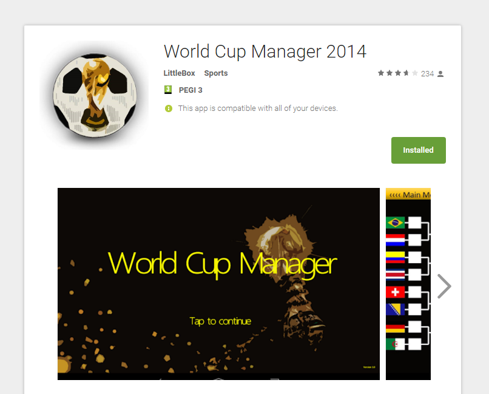

# World Cup Manager

The Computing Project was a module designed to allow students to work in teams to design a piece of software. While no development was needed (for some strange reason...) we decided to implement the mobile application in full to gain extra marks. The mobile app that was written was meant to emulate the World Cup 2014 tournament by allowing users to input their own results to play out different scenarios. The app was written in Java using OpenGL ES with no native controls apart from the message boxes.  

## Assignment

The module assignment was actually just a design document and presentation. The module was more about developing professional skills rather than programming skills. When talking about professional skills I am of course talking about teamwork, communication, leadership and other professional qualities. 

**Requirements**
* Design Document
* Presentation

## Submission

In addition to submitting a lengthy and detailed design report we also submitted copies of the source code and an APK which is the binary file standard for Android. A presentation was written to show off all work and design which included a live demonstration of the Android application incase module lectures couldn't run the official version due to not having an Android device. We received a very high mark for the work as the team went the extra mile and actually implemented our idea and didnt just write about it.

**Android App Features**
* Hardware accelerated graphics
* Full tournament simulation
* Swipe based gestures
* Works on Android 2.2.3+

## License

Apache 2.0
