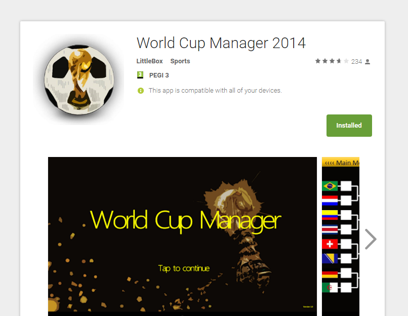

## World Cup Manager

World Cup Manager was a simple world cup 2014 simulator that I built as part of a team for a module in university. The app was written in Java and OpenGL ES with no native controls apart from the message boxes.

## Assignment

Expain assignment

## Submission

Expain submission

* Hardware accelerated graphics
* Full tournament simulation
* Swipe based gestures
* Works on Android 2.2.3+

## License

Apache 2.0
